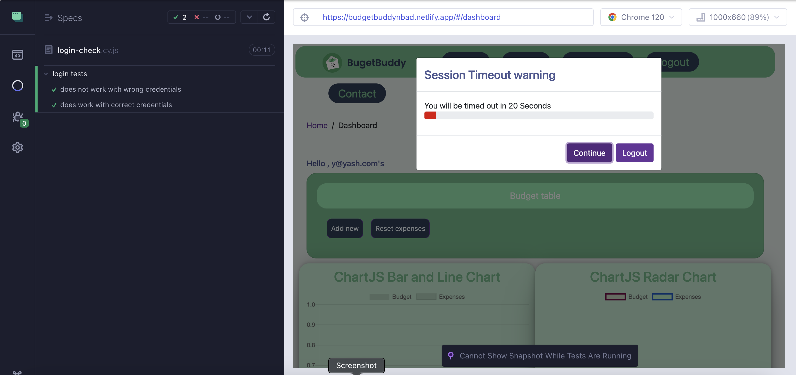
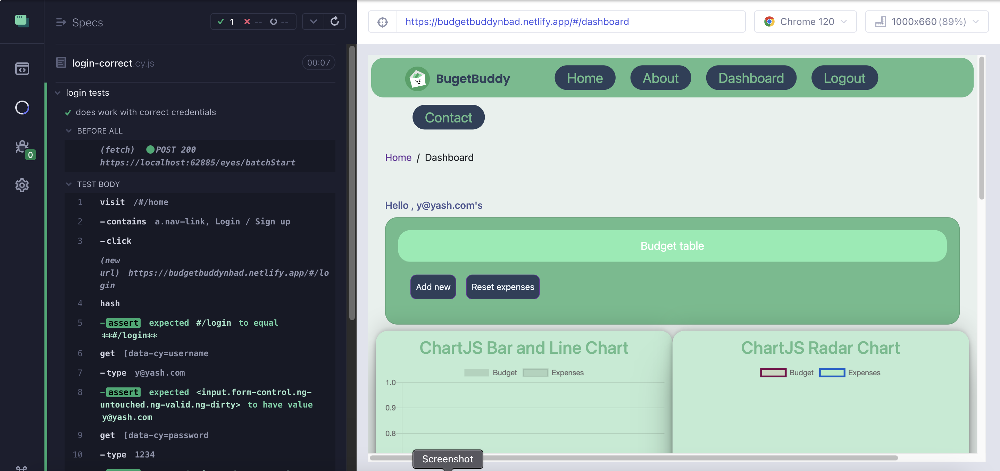
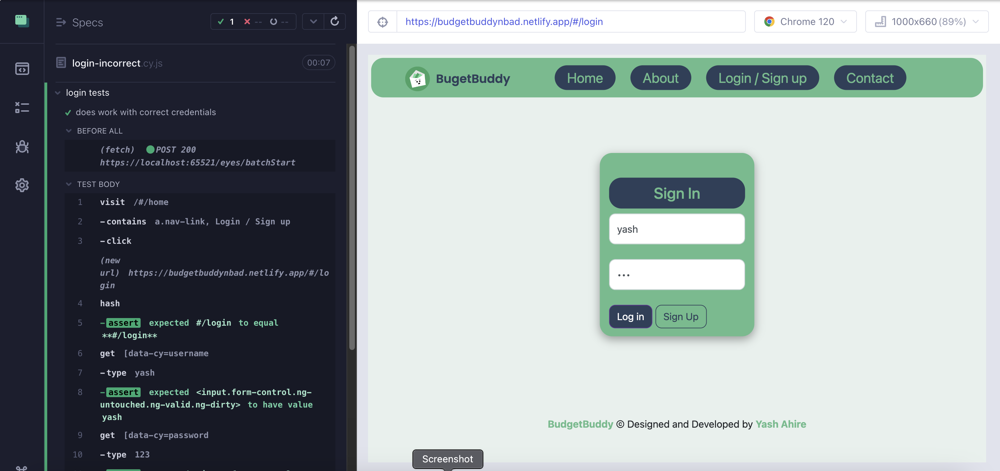
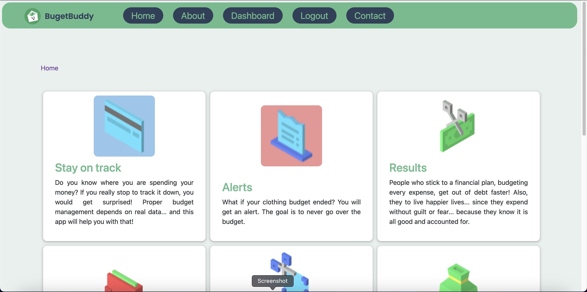
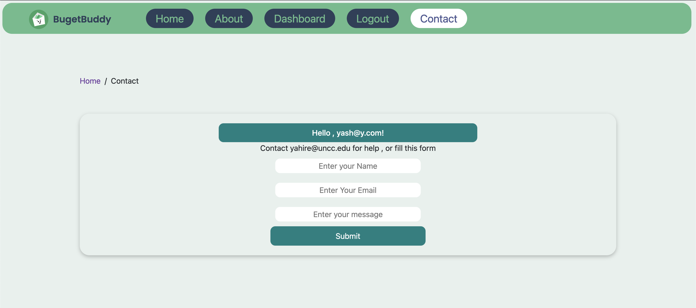
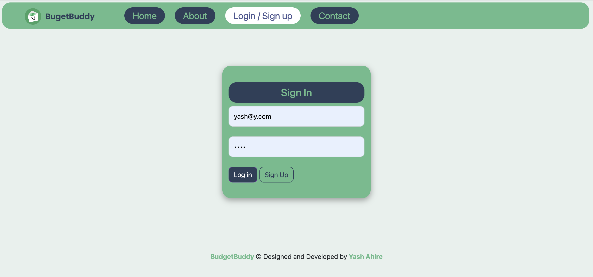
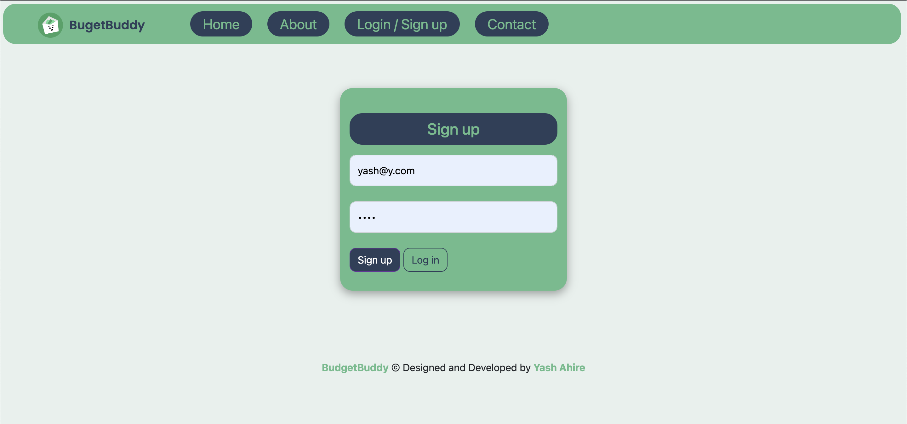
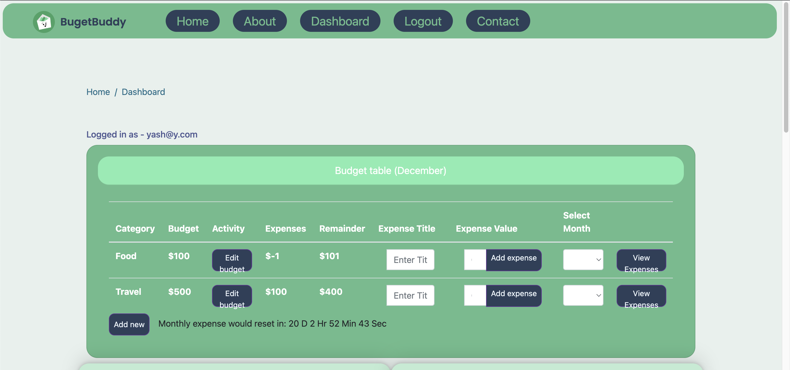
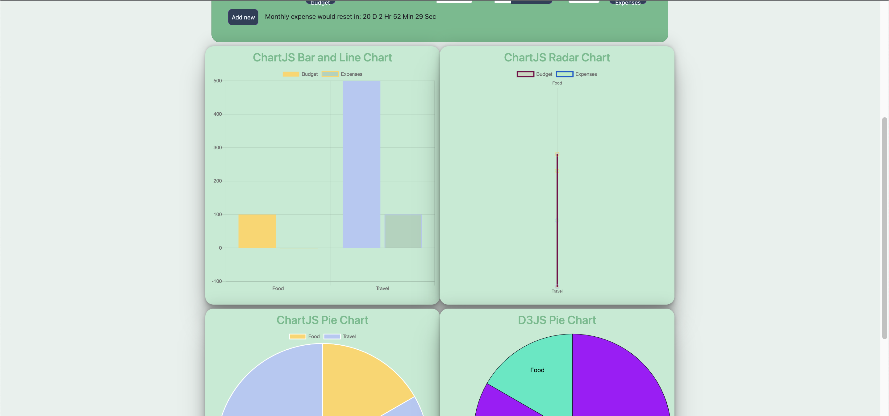

<br>

---

<div style="background-color: #2D4059; color: white; padding: 10px 20px; font-size: 16px; border: none; border-radius: 20px; cursor: pointer; margin:10px;">
<h1>NBAD FINAL PROJECT</h1>

<h3>BudgetBuddy: Personal Budget Application</h3>


## **Submitted By: Yash Ahire**

<a href="https://budgetbuddynbad.netlify.app/" style="text-decoration: none;">
    <button style="background-color: #2D4059; color: white; padding: 10px 20px; font-size: 16px; border: none; border-radius: 5px; cursor: pointer;">Live Demo</button>
<a href="https://budgetbuddynbad.netlify.app/" style="text-decoration: none;">
    <button style="background-color: #2D4059; color: white; padding: 10px 20px; font-size: 16px; border: none; border-radius: 5px; cursor: pointer;">Github</button>

---

- Use the following credentials for testing:
  - **Username:** y@yash.com
  - **Password:** 1234

---

**Execution Instructions**

<div style="background-color: #2D4059; color: white; padding: 10px 20px; font-size: 16px; border: none; border-radius: 20px; cursor: pointer; margin:10px;"><span>Note: Ensure the use of Node version <span style="background-color: #ffd460;color: black;padding:2px;border-radius:10px;" > 20.8.1.</span> Nvm install 20.8.1 , nvm use 20.8.1 If any errors occur, delete the <span style="background-color: #ffd460;color: black;padding:4px;border-radius:10px;" >node_modules</span> directory and proceed with the steps below again.</span></div>

1. Getting started with the server:

```bash
  cd server
```

```bash
  npm install
```

```bash
  node server.js
```

---

2. Run Main Project (New Terminal):

```bash
cd spend-wise
```

```bash
npm install --force
```

```bash
export NODE_OPTIONS=--openssl-legacy-provider
```

```bash
ng serve
```

---

**Guidelines for Running Test Cases**

### E2E:

<div style="background-color: #2D4059; color: white; padding: 10px 20px; font-size: 16px; border: none; border-radius: 20px; cursor: pointer; margin:10px;"><span>The test cases are located at:
`.
 <span style="background-color: #ffd460;color: black;padding:2px;border-radius:10px;" > /personal-budget/cypress/e2e</span>  <span style="background-color: #ffd460;color: black;padding:4px;border-radius:10px;" >Note</span>  To execute the e2e test case, both the backend server (node server.js) and ng serve should be operational._</span></div>

### To run tests :

```bash
cd spend-wise
```

```bash
export APPLITOOLS_API_KEY=UGT6SGZonA5GCD8mlXSKnifPI1L1BJ2sC2LOAf105pjk4110
```

```bash
npx cypress open
```

</div>
#### Potential Errors:

<div style="background-color: #2D4059; color: white; padding: 10px 20px; font-size: 16px; border: none; border-radius: 20px; cursor: pointer; margin:10px;"><span>"If encountering the error message 'Sorry, we could not load: http://localhost:4200/home'."

<div style="background-color: #2D4059; color: white; padding: 10px 20px; font-size: 16px; border: none; border-radius: 20px; cursor: pointer; margin:10px;">
 <span > 1. Restart both the backend server (node server.js) and the frontend server (ng serve).   . . .</span> </div> 
 <div style="background-color: #2D4059; color: white; padding: 10px 20px; font-size: 16px; border: none; border-radius: 20px; cursor: pointer; margin:10px;">
 <span >2. Attempt running the above commands again. This should resolve the issue.
</span>  </div>

If experiencing issues related to Cypress installation, please execute these commands:

```bash
npm install cypress@13.6.1 -f
```

```bash
export APPLITOOLS_API_KEY=Fxs2XevR7jqp1mBFJOnIUJ1105ORvQJOvetSxUtki97w4110
```

```bash
npx cypress open
```

#### E2E Results





### Unit Tests

```bash
cd spend-wise
```

```bash
ng test
```

---

#### Results of Unit Tests

---

**Application Snapshots:**

**HomePage**



**AboutPage**


**Contact Page**



**Login**



**Register**



**Dashboard**



**Charts**



---

</div>
</body>
</html>
